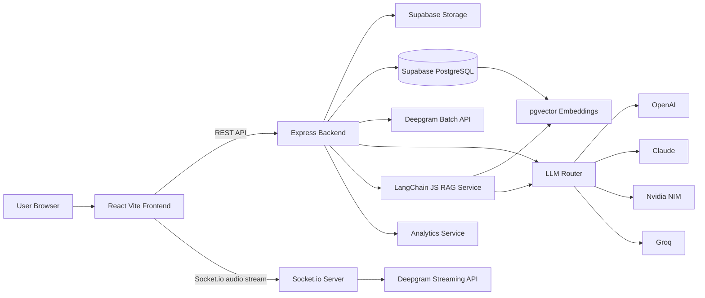

# AI Meeting Intelligence Platform

Production-quality university end-term project for converting meeting recordings and live calls into structured, searchable knowledge assets.

## Architecture



## Fixed Stack

Frontend:
- React.js with Vite
- Tailwind CSS
- React Router
- Socket.io client
- Recharts

Backend:
- Node.js
- Express.js
- Socket.io
- JavaScript only

Database:
- Supabase PostgreSQL
- Supabase Storage
- pgvector

AI:
- Deepgram for transcription and speaker diarization
- OpenAI or Claude as primary LLM provider
- Nvidia NIM fallback
- Groq fallback
- LangChain JS for RAG

## Dependencies

Frontend:

```bash
npm install react-router-dom socket.io-client recharts axios lucide-react
npm install -D vite tailwindcss postcss autoprefixer
```

Backend:

```bash
npm install express cors dotenv helmet morgan multer socket.io @supabase/supabase-js
npm install @deepgram/sdk openai @anthropic-ai/sdk @langchain/textsplitters
npm install groq-sdk uuid zod
npm install -D nodemon
```

## Required Structure

```text
meeting-ai/
  frontend/
    src/
      components/
      pages/
      hooks/
      services/
      utils/

  backend/
    routes/
    controllers/
    services/
    middlewares/
    utils/
    config/
    prompts/

  database/
```

## Build Order

1. System architecture, dependencies, and folder structure
2. Backend initialization, Express server, Socket.io server, and environment config
3. Supabase integration and database schema
4. Deepgram service
5. LLM router
6. RAG pipeline
7. Frontend setup
8. UI pages
9. Testing and deployment

## Architecture Rule

Routes call controllers. Controllers call services. Services own business logic, AI calls, database access, and external integrations.

## Local Setup

Backend:

```bash
cd backend
cp .env.example .env
npm install
npm run dev
```

Frontend:

```bash
cd frontend
cp .env.example .env
npm install
npm run dev
```

Supabase:
- Run `database/schema.sql` in the Supabase SQL editor.
- Create a private storage bucket matching `SUPABASE_STORAGE_BUCKET`.
- Enable pgvector before inserting transcript embeddings.

## Deployment

Vercel frontend settings:

```text
Root Directory: frontend
Build Command: npm run build
Output Directory: dist
```

Required Vercel environment variables:

```env
VITE_API_URL=https://your-backend.vercel.app/api
VITE_LIVE_MEETING_ENABLED=true
```

Do not use `localhost` in Vercel environment variables. Redeploy after changing any `VITE_*` value because Vite embeds these variables during the build.

Vercel backend settings:

```text
Root Directory: backend
Framework Preset: Other
```

Required backend environment configuration:

```env
NODE_ENV=production
CLIENT_ORIGIN=https://your-frontend.vercel.app
```

Use a comma-separated `CLIENT_ORIGIN` value when both a production domain and Vercel preview domain must be allowed.

The upload flow uses a signed Supabase URL. Recording bytes travel directly from the browser to Supabase Storage instead of passing through a Vercel Function, avoiding Vercel's function request body limit.

Live meeting mode works on Vercel without Socket.io. The backend issues a short-lived Deepgram token, the browser streams microphone audio directly to Deepgram, and the completed transcript is finalized through the REST meeting endpoint.

Deepgram temporary tokens require an API key with Member or higher authorization. When the configured key cannot grant temporary tokens, the browser records short standalone audio slices and sends them to Deepgram through small Vercel HTTP requests. This preserves live transcript updates without exposing the permanent API key or requiring persistent backend WebSockets.

## NVIDIA NIM

Create a development API key from [NVIDIA Build](https://build.nvidia.com/) and configure:

```env
LLM_PROVIDER=nvidia_nim
EMBEDDING_PROVIDER=nvidia_nim
EMBEDDING_DIMENSIONS=1536
NVIDIA_NIM_API_KEY=nvapi-your-key
NVIDIA_NIM_BASE_URL=https://integrate.api.nvidia.com/v1
NVIDIA_NIM_CHAT_MODEL=meta/llama-3.1-70b-instruct
NVIDIA_NIM_EMBEDDING_MODEL=nvidia/nv-embedqa-e5-v5
```

Model IDs are configurable because hosted model availability can change. Copy the model ID shown in the API example for the selected model on NVIDIA Build.

The default NVIDIA embedding model returns 1024 values. The backend pads these vectors to the schema's 1536 dimensions so NVIDIA NIM and OpenAI embeddings remain compatible with the same pgvector table and RPC.
